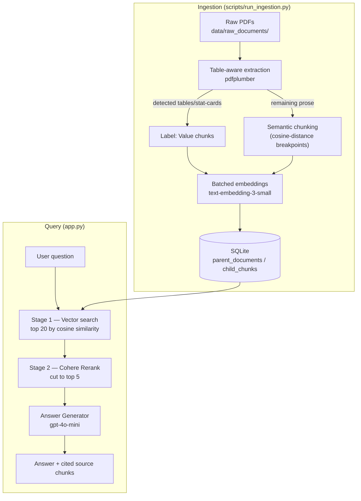

# Financial Analyst Agent

A retrieval-augmented question-answering system over Commonwealth Bank of Australia's (CBA) 2026 financial disclosures — ask a question in plain English, get back a cited, grounded answer.

Ask "What was CBA's statutory net profit after tax for the 2026 half year?" and it retrieves the relevant disclosure passages, reranks them for precision, and generates an answer with the exact source chunks it used — not a black box.

## Architecture



Every OpenAI/Cohere call is metered by an in-memory FinOps budget controller ([src/utils/billing.py](src/utils/billing.py)) that hard-stops a run once it crosses a configurable cost cap (`$0.50` by default per pipeline instance) — a safety net against runaway API spend, not just a cost estimate.

## Setup

**Prerequisites**: Python 3.12+, an [OpenAI API key](https://platform.openai.com/api-keys), and a [Cohere API key](https://dashboard.cohere.com/api-keys) (free tier is sufficient for this project's scale).

```bash
# 1. Clone and enter the repo
git clone https://github.com/shyalika/financial-analyst-agent.git
cd financial-analyst-agent

# 2. Create a virtual environment and install dependencies
python3 -m venv venv
source venv/bin/activate  # Windows: venv\Scripts\activate
pip install -r requirements.txt

# 3. Configure API keys
cp .env.example .env
# then edit .env and fill in OPENAI_API_KEY and COHERE_API_KEY

# 4. Ingest the source documents (one-time; ~$0.17 in OpenAI API cost)
python scripts/run_ingestion.py

# 5. Launch the app
streamlit run app.py
```

Step 4 scans every PDF in `data/raw_documents/` and ingests any not already in `data/financial_intelligence.db` (it's git-ignored, since it's fully regenerated by this step and too large to commit — see `.gitignore`). Step 5 opens the app at `http://localhost:8501`.

## What's in `data/raw_documents/`

Seven real CBA disclosure PDFs are included in this repo so ingestion works out of the box with no manual downloading: the 2026 half-year and full-year ASX announcements and profit announcements, the 3Q26 trading update, a dividend distribution notice, and the full 2026 annual report.

## Project layout

```
src/ingestion/      PDF extraction (table-aware), semantic chunking, embedding, SQLite persistence
src/retrieval/       Query expansion, HyDE, similarity search, two-stage retrieval + rerank, eval harnesses
src/generation/      Answer generation, Faithfulness/Context Precision evaluation
src/utils/           FinOps budget controller
scripts/             CLI entrypoints for ingestion and each retrieval/eval component
app.py               Streamlit UI
```

## Development history and known limitations

This project was built iteratively with heavy use of real evaluation (hit-rate metrics, LLM-judged Faithfulness/Context Precision, headless-browser UI testing) rather than assumptions — including negative results that were kept, not hidden, when an approach didn't pan out. **[SPEC.md](SPEC.md)** is the full technical narrative: every component's design, every debugging investigation, every measured before/after, and everything still open — including a known limitation with multi-document corpora (the system currently has no way to disambiguate "which reporting period" a question means when multiple overlapping documents are ingested) and its named mitigations. Worth reading if you're evaluating this as more than a demo.

## Tech stack

OpenAI (`gpt-4o-mini`/`gpt-4o`, `text-embedding-3-small`) · Cohere Rerank · DeepEval · Streamlit · SQLite · pdfplumber
